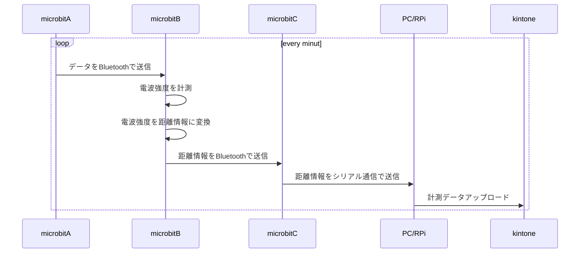
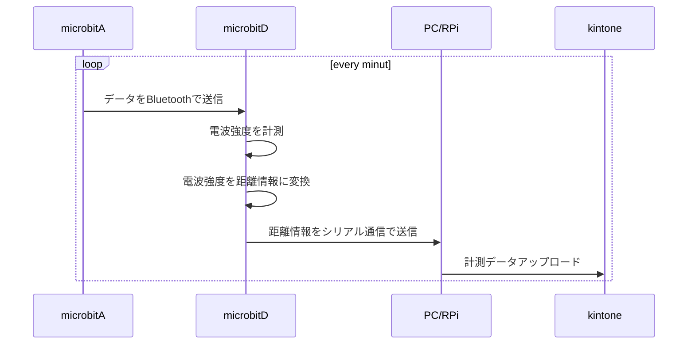
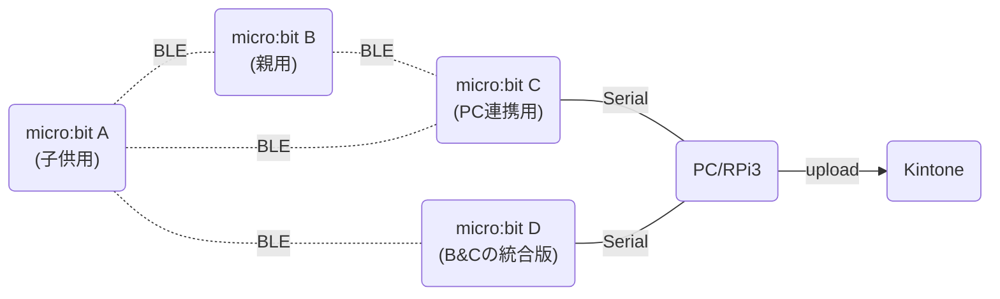
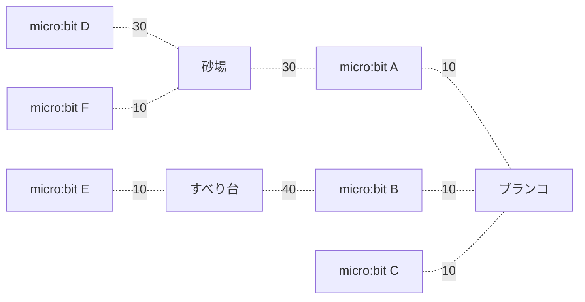

# micro:bitを使った距離計測システム

micro:bitが無線通信を実施した際に取得できる電界強度の情報をもとに  
お互いの距離を計測することができる。

## 簡易シーケンス





## 簡易構成図



## Spec

### micro:bit 無線強度

signal strength: the value ranges from -128 to -42 (-128 means a weak signal and -42 means a strong one.)

## Installations

### pythonパッケージ

```python
pip3 install PySerial
```

### node.jsパッケージ

```javascript
npm install serialport
```

## Usage

### python環境

```shell
python3 microbit_serial.py
```

### node.js環境

```shell
node microbit_serial.js
```

## 拡張/発展案

micro:bitの機能に自身のシリアル番号を取得することができる。  
これを利用して個体識別をすることで、同一プログラムで複数台のmicro:bitを利用することができる。

上記で記載したシステム構成図、シーケンス図では子機側から親機に向かって情報を送信し  
親機で距離を算出しているが、親機が情報を送信しそれを受信した子機が一定の距離以内だった場合に  
応答を返す（この際にシリアル番号をつける)ことも可能。  
この場合、親機側で送信周期などを変更することが可能になるため  
改修の際などの手間を減らす事ができる。

