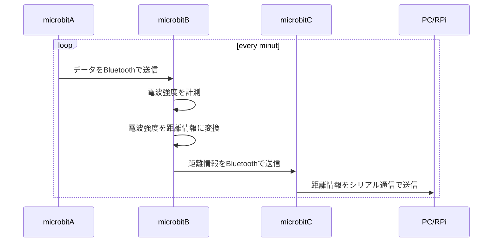
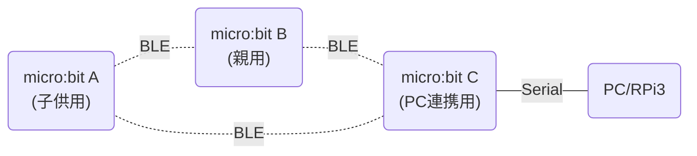

# micro:bitを使った距離計測システム

micro:bitが無線通信を実施した際に取得できる電界強度の情報をもとに  
お互いの距離を計測することができる。

## 簡易シーケンス

```mermaid
sequenceDiagram
  loop every minut
    microbitA->>microbitB: データをBluetoothで送信
    microbitB->>microbitB: 電波強度を計測
    microbitB->>microbitB: 電波強度を距離情報に変換
    microbitB->>microbitC: 距離情報をBluetoothで送信
    microbitC->>PC/RPi: 距離情報をシリアル通信で送信
  end
```

## 簡易構成図

```mermaid
graph LR
  MA("micro:bit A<br />(子供用)")
  MB("micro:bit B<br />(親用)")
  MC("micro:bit C<br />(PC連携用)")
  PC("PC/RPi3")

  MA-.-|BLE|MB
  MB-.-|BLE|MC
  MC-.-|BLE|MA
  MC---|Serial|PC
```
