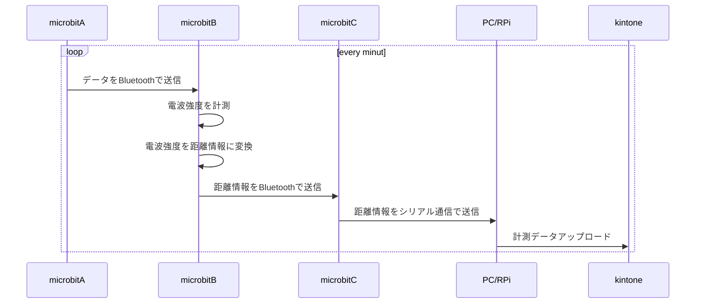
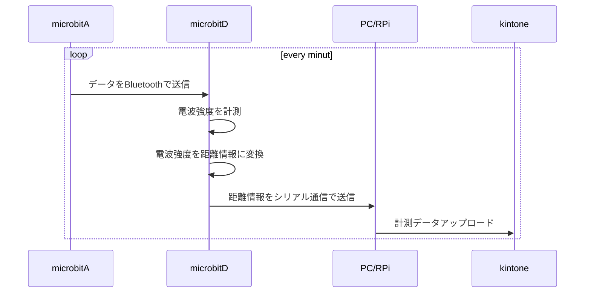
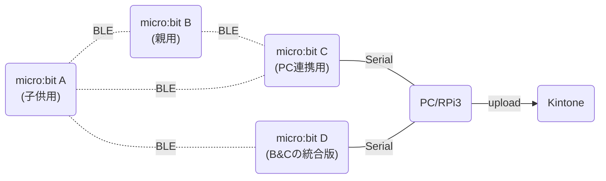

# micro:bitを使った距離計測システム

micro:bitが無線通信を実施した際に取得できる電界強度の情報をもとに  
お互いの距離を計測することができる。

## 簡易シーケンス





## 簡易構成図



## Spec

### micro:bit 無線強度

signal strength: the value ranges from -128 to -42 (-128 means a weak signal and -42 means a strong one.)

## Installations

### pythonパッケージ

```python
pip3 install PySerial
```

### node.jsパッケージ

```javascript
npm install serialport
```

## Usage

### python環境

```shell
python3 microbit_serial.py
```

### node.js環境

```shell
node microbit_serial.js
```
