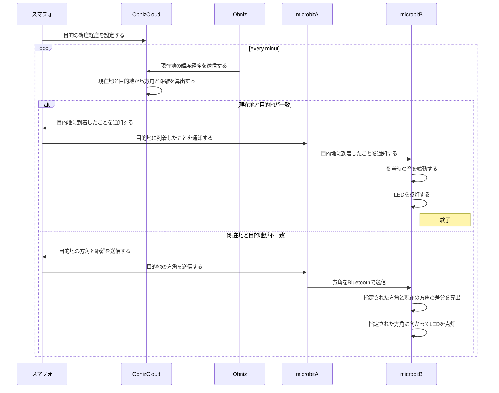
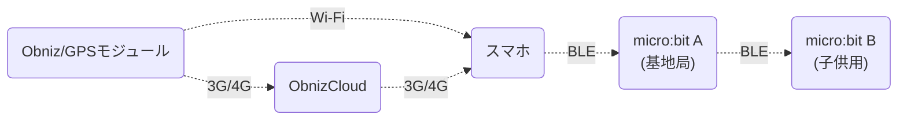

# micro:bitを方角指示デバイス

micro:bitの地磁気センサーを利用して、外部から指定された方角をLEDで示す  
※スマフォ、Obnizの役割は仮設定

## 簡易シーケンス

```mermaid
sequenceDiagram
  スマフォ->>ObnizCloud: 目的の緯度経度を設定する
  loop every minut
    Obniz->>ObnizCloud: 現在地の緯度経度を送信する
    ObnizCloud->>ObnizCloud: 現在地と目的地から方角と距離を算出する
    alt 現在地と目的地が一致
      ObnizCloud->>スマフォ: 目的地に到着したことを通知する
      スマフォ->>microbitA: 目的地に到着したことを通知する
      microbitA->>microbitB: 目的地に到着したことを通知する
      microbitB->>microbitB: 到着時の音を鳴動する
      microbitB->>microbitB: LEDを点灯する
      Note right of microbitB: 終了
    else 現在地と目的地が不一致
      ObnizCloud->>スマフォ: 目的地の方角と距離を送信する
      スマフォ->>microbitA: 目的地の方角を送信する
      microbitA->>microbitB: 方角をBluetoothで送信
      microbitB->>microbitB: 指定された方角と現在の方角の差分を算出
      microbitB->>microbitB: 指定された方角に向かってLEDを点灯
    end
  end
```

## 簡易構成図

```mermaid
graph LR
  Obniz("Obniz/GPSモジュール")
  SP("スマホ")
  ObnizCloud("ObnizCloud")
  MA("micro:bit A<br />(基地局)")
  MB("micro:bit B<br />(子供用)")

  Obniz -.->|Wi-Fi|SP
  Obniz -.->|3G/4G|ObnizCloud
  ObnizCloud -.->|3G/4G|SP
  SP -.->|BLE|MA
  MA-.->|BLE|MB
```

## Spec
